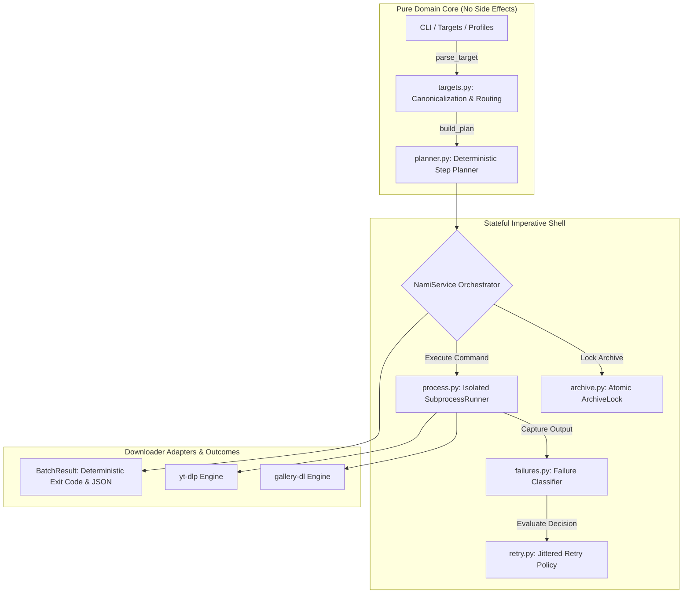

<div align="center">

# 🌊 Nami

### *An open-source CLI media downloader for Instagram, TikTok, Facebook, and X*

[](https://github.com/OpenSelena/nami/actions/workflows/ci.yml)
[](https://pypi.org/project/nami/)
[](https://pypi.org/project/nami/)
[](LICENSE)
[](https://github.com/OpenSelena/nami)

<p align="center">
  Nami coordinates <b>gallery-dl</b> and <b>yt-dlp</b> through a pure functional planning core and deterministic execution shell.<br>
  Built for high-res batch downloads, atomic deduplication, resilient failure classification, and automated headless pipelines.
</p>

[Platform Matrix](#platform-support-matrix) • [Architecture](#deep-module-architecture) • [Installation](#installation) • [Quickstart](#quickstart) • [CLI Reference](#cli-reference) • [Configuration](#configuration--environment-variables) • [Diagnostics](#system-diagnostics)

</div>

---

## Highlights

<table>
<tr>
<td width="50%">

### ⚡ Dual-Engine Routing
Intelligently routes photos, stories, and highlights to **`gallery-dl`** with automatic extractor fallback to **`yt-dlp`** for video content ([ADR-0001](docs/adr/0001-dual-engine-architecture.md)).

</td>
<td width="50%">

### 🔒 Atomic Containment & Locking
Per-target PID-keyed `archive.lock` prevents concurrent race conditions. Strict `safe_target_dir` guarantees zero path-traversal escapes.

</td>
</tr>
<tr>
<td width="50%">

### 🎯 Pure Functional Planning
Planning layer maps inputs to deterministic `PlanStep` sequences with zero I/O side effects, enabling sub-second offline unit testing.

</td>
<td width="50%">

### 🚀 Universal Invocation
Run interactively via Rich terminal UI or headlessly in CI/CD pipelines via `nami` or `python -m nami` with structured `--json` output.

</td>
</tr>
</table>

---

## Table of Contents

- [Platform Support Matrix](#platform-support-matrix)
- [Deep Module Architecture](#deep-module-architecture)
- [Installation](#installation)
- [Quickstart](#quickstart)
  - [1. Interactive Mode](#1-interactive-terminal-ui)
  - [2. CLI Batch Invocations](#2-cli-batch-invocations)
- [Workspace Hierarchy](#workspace-hierarchy)
- [CLI Reference](#cli-reference)
  - [`nami download`](#nami-download)
  - [`nami setup`](#nami-setup)
  - [`nami doctor`](#nami-doctor)
  - [`nami config`](#nami-config)
  - [`nami archive reset`](#nami-archive-reset)
- [Authentication & Cookies](#authentication--cookies)
- [Failure Taxonomy & Retry Policy](#failure-taxonomy--retry-policy)
- [Deterministic Exit Codes](#deterministic-exit-codes)
- [Configuration & Environment Variables](#configuration--environment-variables)
- [Development & Verification](#development--verification)
- [License](#license)

---

## Platform Support Matrix

| Platform | Photos & Posts | Videos & Reels | Stories | Highlights | Auth Method | Primary Engine |
| :--- | :---: | :---: | :---: | :---: | :--- | :--- |
| **Instagram** | `Supported` | `Supported` | `Supported` | `Supported` | Netscape Cookie / Anonymous | `gallery-dl` / `yt-dlp` (Fallback) |
| **TikTok** | `Limited` | `Supported` | `Unsupported` | `Unsupported` | Browser DB / Netscape Cookie | `yt-dlp` / `gallery-dl` |
| **Facebook** | `Limited` | `Supported` | `Unsupported` | `Unsupported` | Netscape Cookie / Anonymous | `gallery-dl` / `yt-dlp` |
| **X (Twitter)** | `Limited` | `Supported` | `Unsupported` | `Unsupported` | Netscape Cookie / Anonymous | `gallery-dl` / `yt-dlp` |

> [!NOTE]
> Unsupported platform/media combinations emit structured `Outcome.UNSUPPORTED` records and exit with status `3` rather than silently failing or creating empty files.

---

## Deep Module Architecture

Nami is engineered around **deep modules** with narrow interfaces that hide extensive implementation complexity:



### Module Seam Boundaries

| Module | Public Seam Interface | Encapsulated Implementation Complexity |
| :--- | :--- | :--- |
| [`targets.py`](src/nami/targets.py) | `parse_target()`, `safe_target_dir()`, `resolve_target_endpoints()` | Regex URL parsing, host canonicalization, control character scrubbing, directory containment validation. |
| [`planner.py`](src/nami/planner.py) | `build_plan(DownloadRequest) -> tuple[PlanStep, ...]` | Side-effect free step expansion, media kind filtering, Cartesian product generation. |
| [`archive.py`](src/nami/archive.py) | `ArchiveLock`, `discover_archives()`, `reset_archives()` | Atomic non-blocking PID-keyed file locking, stale lock detection, `.bak` file generation. |
| [`process.py`](src/nami/process.py) | `SubprocessRunner.run(CommandSpec) -> CommandResult` | Zero-shell process execution, credential redaction, wall-clock timeouts, cross-platform process tree cleanup. |
| [`failures.py`](src/nami/failures.py) | `classify_failure()`, `failure_message()` | Error log scraping, diagnostic precedence ranking, deterministic `FailureKind` categorization. |
| [`retry.py`](src/nami/retry.py) | `RetryPolicy.decide() -> RetryDecision` | Bounded exponential backoff calculation with deterministic PRNG jitter. |

---

## Installation

Requires **Python 3.10 or newer**.

```bash
python -m pip install nami
```

To update an existing installation:

```bash
python -m pip install --upgrade nami
```

---

## Quickstart

### 1. Interactive Terminal UI

Launch interactive menu via `nami` or `python -m nami`:

```bash
nami
# or
python -m nami
```

```text
╭─ Nami ───────────────────────────────────────────────────────────── v5.0.4 ─╮
│ What do you want to download?                                               │
│                                                                             │
│  1  Photos only                                                             │
│  2  Videos only                                                             │
│  3  Stories only                                                            │
│  4  Highlights only                                                         │
│  5  Photos + Videos                                                         │
│  6  Stories + Highlights                                                    │
│  7  All                                                                     │
│  8  Settings                                                                │
│  0  Exit                                                                    │
│                                                                             │
│  Save: ~/Nami/downloads                                                     │
╰─────────────────────────────────────────────────────────────────────────────╯
```

### 2. CLI Batch Invocations

```bash
# Download direct posts and reels
nami download https://www.instagram.com/p/C_EXAMPLE/ https://x.com/OpenAI/status/1234567890

# Target specific profile media
nami download https://www.instagram.com/natgeo/ --media photos,videos

# Headless batch processing with JSON stdout
nami download --profiles --platform instagram --media all --json
```

---

## Workspace Hierarchy

```text
Nami/
├── downloads/                     # Downloaded media grouped by platform & account
│   ├── instagram/
│   │   └── natgeo/
│   │       ├── Photos/            # Downloaded image assets
│   │       │   └── archive.txt    # Deduplication tracking record
│   │       ├── Videos/            # Downloaded video assets
│   │       │   └── archive.txt
│   │       └── Stories/           # Downloaded story assets
│   │           └── archive.txt
│   └── tiktok/
│       └── example_user/
│           └── Videos/
│               └── archive.txt
├── cookies/                       # Netscape-format cookie files (*_cookies.txt)
│   ├── instagram_cookies.txt
│   ├── tiktok_cookies.txt
│   ├── facebook_cookies.txt
│   └── x_cookies.txt
└── profiles/                      # Batch target profile lists (*_profiles.txt)
    ├── instagram_profiles.txt
    ├── tiktok_profiles.txt
    ├── facebook_profiles.txt
    └── x_profiles.txt
```

---

## CLI Reference

### `nami download`

Plan and execute downloads for individual URLs or profile lists.

```bash
nami download [URL ...] [OPTIONS]
```

| Parameter / Flag | Type | Description |
| :--- | :--- | :--- |
| `URL ...` | Positional | One or more content or profile URLs |
| `--profiles` | Flag | Batch download all targets listed in `profiles_dir` |
| `--platform` | Option | Filter or specify platform (`instagram`, `tiktok`, `facebook`, `x`) |
| `--media` | Option | Target media types: `photos`, `videos`, `stories`, `highlights`, `all` |
| `--json` | Flag | Output structured JSON for automation |

---

### `nami setup`

Initialize directory layout and generate default configuration.

```bash
nami setup [OPTIONS]
```

| Flag | Type | Description |
| :--- | :--- | :--- |
| `--root <PATH>` | Option | Set root parent directory for the workspace |
| `--cookie-templates` | Flag | Generate template cookie files in `cookies/` |
| `--json` | Flag | Output workspace initialization result as JSON |

---

### `nami doctor`

Run read-only system diagnostic checks without network activity.

```bash
nami doctor [OPTIONS]
```

| Flag | Type | Description |
| :--- | :--- | :--- |
| `--json` | Flag | Emit structured health checks and remediation advice in JSON |

```text
PASS  config: Configuration loaded successfully
PASS  python: Python 3.14.7 (>= 3.10 required)
PASS  dependencies: All required packages are installed
PASS  workspace: Base directory is writable
PASS  browser: Brave is installed and unlocked
PASS  cookies: Netscape cookies valid
PASS  urllib3: Clean namespace (no conflicts)
PASS  archive_locks: No stale locks detected
```

---

### `nami config`

Manage persistent settings in `~/.nami/nami_config.json`.

```bash
nami config show [--json]
nami config get <KEY> [--json]
nami config set <KEY> <VALUE> [--json]
nami config unset <KEY> [--json]
```

| Key | Valid Values | Description |
| :--- | :--- | :--- |
| `base_dir` | Valid path string | Root directory for downloaded media |
| `cookies_dir` | Valid path string | Directory containing Netscape cookie files |
| `profiles_dir` | Valid path string | Directory containing `*_profiles.txt` lists |
| `browser` | `brave`, `chrome`, `edge`, `firefox` | Browser for automated cookie extraction |
| `user_agent` | Custom string | HTTP User-Agent string sent to engines |
| `timeout_seconds` | Integer (`> 0`) | Subprocess execution deadline |

---

### `nami archive reset`

Manage download tracking records (`archive.txt`) safely without data loss.

```bash
nami archive reset [OPTIONS]
```

| Flag | Type | Description |
| :--- | :--- | :--- |
| `--all` | Flag | Target all archives across all platforms |
| `--platform <NAME>` | Option | Target archives for a specific platform |
| `--target <KEY>` | Option | Target archives for a specific account/target |
| `--media <KIND>` | Option | Filter archives by media kind |
| `--dry-run` | Flag | Preview affected archives without modifying disk |
| `--delete` | Flag | Permanently delete matching archives (default: create `.bak`) |
| `--yes` | Flag | Confirm mutation without interactive prompt |
| `--json` | Flag | Output affected archive list in JSON |

---

## Authentication & Cookies

### 1. Netscape Cookie Files
Place exported cookies into `cookies_dir`. Nami verifies that files contain genuine 7-column rows before mounting them to child engines:
- `instagram_cookies.txt` or `instagram.com_cookies.txt`
- `tiktok_cookies.txt` or `tiktok.com_cookies.txt`
- `facebook_cookies.txt` or `facebook.com_cookies.txt`
- `x_cookies.txt` or `x.com_cookies.txt`

### 2. Browser Database Session Extraction
For TikTok downloads without an explicit cookie file, Nami extracts session tokens directly from local browser stores (`brave`, `chrome`, `edge`, `firefox`).

---

## Failure Taxonomy & Retry Policy

`failures.py` maps engine stderr diagnostics into typed `FailureKind` categories:

| Failure Category | Classification Criteria | Recovery Strategy |
| :--- | :--- | :--- |
| `FailureKind.AUTH` | HTTP 401, login required, session expired | 1 anonymous retry if credentials were provided |
| `FailureKind.COOKIE` | Corrupt or undecryptable cookie file | 1 anonymous retry if credentials were provided |
| `FailureKind.RATE_LIMIT` | HTTP 429, temporary platform block | Terminate immediately without cross-engine churn |
| `FailureKind.NETWORK` | Connection reset, TLS failure, DNS timeout | Up to 3 attempts with exponential jittered backoff |
| `FailureKind.EXTRACTOR` | Route failure, extractor deprecation | 1 retry on secondary engine (`yt-dlp`) |
| `FailureKind.NOT_FOUND` | HTTP 404, user not found, private media | Stop immediately with `Outcome.NO_RESULTS` |
| `FailureKind.DEPENDENCY` | Missing binary or unimportable module | Stop immediately |
| `FailureKind.TIMEOUT` | Subprocess wall-clock deadline exceeded | Up to 3 attempts with exponential backoff |
| `FailureKind.LOCKED` | Archive lock contention or account challenge | Stop immediately |

---

## Deterministic Exit Codes

| Exit Code | Identifier | Meaning |
| :---: | :--- | :--- |
| **`0`** | `SUCCESS` | All plan steps downloaded or already up to date |
| **`1`** | `FAILED` | Unrecoverable error occurred on one or more operations |
| **`2`** | `INVALID` | Malformed CLI syntax, invalid URL, or corrupted configuration |
| **`3`** | `PARTIAL / WARN` | Mixed outcomes, unsupported operations, or doctor warnings |
| **`4`** | `NO_RESULTS` | Extractor ran successfully but found zero downloadable items |
| **`130`** | `CANCELLED` | Execution interrupted via `SIGINT` (Ctrl+C) |

---

## Configuration & Environment Variables

| Setting Key | Environment Variable | Default Value | Description |
| :--- | :--- | :--- | :--- |
| `base_dir` | `NAMI_BASE_DIR` | `~/Nami/downloads` | Root directory for downloads |
| `cookies_dir` | `NAMI_COOKIES_DIR` | `~/Nami/cookies` | Directory for Netscape cookies |
| `profiles_dir` | `NAMI_PROFILES_DIR` | `~/Nami/profiles` | Directory for target profile lists |
| `browser` | `NAMI_BROWSER` | `brave` | Browser for automated cookie discovery |
| `user_agent` | `NAMI_USER_AGENT` | Chrome Default | HTTP User-Agent header |
| `timeout_seconds` | `NAMI_TIMEOUT_SECONDS` | `1800` | Process execution deadline in seconds |
| — | `NAMI_THEME` | `auto` | Terminal styling theme (`dark`, `light`, `auto`) |
| — | `NAMI_SKIP_ENV_CHECK` | `0` | Set to `1` to bypass startup environment checks |

---

## Development & Verification

### Local Environment Setup

```bash
git clone https://github.com/OpenSelena/nami.git
cd nami
python -m pip install --upgrade pip
python -m pip install -e ".[dev]"
```

### Verification Commands

```bash
# Run pytest unit test suite
python -m pytest

# Run Ruff linter and code formatter checks
python -m ruff check src tests
python -m ruff format --check src tests

# Verify package build & metadata
python -m build
python -m twine check dist/*
```

---

## License

Distributed under the [MIT License](LICENSE). Developed and maintained by **[Igect](https://github.com/Igect)** under **[OpenSelena](https://github.com/OpenSelena)**.
